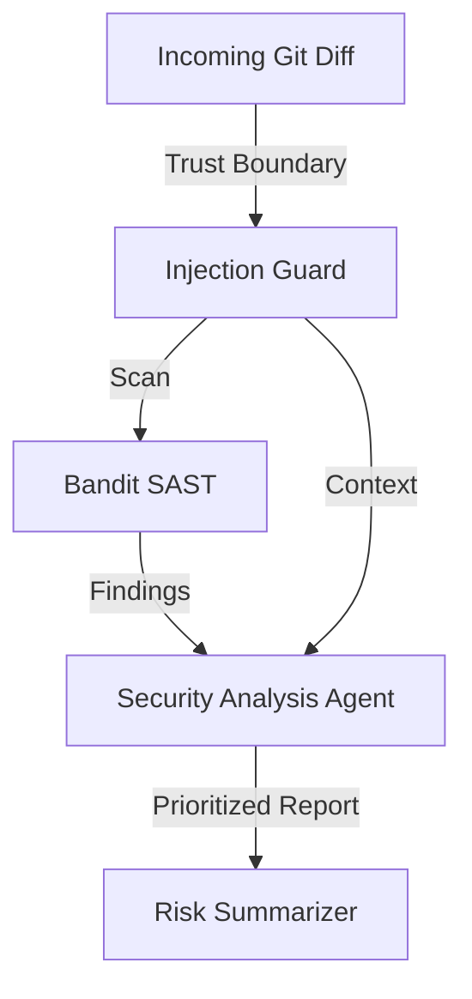

# CodeRev Agents - LLM-Assisted Security Code Review

[](https://github.com/poojakira/coderev-agents/actions)


CodeRev Agents is an LLM-powered security code review prototype that integrates traditional static analysis (SAST) with the reasoning capabilities of Large Language Models.

## 🚀 How it Works

1. **Static Analysis**: The system runs `Bandit` (and optionally `Semgrep`) on the incoming diff.
2. **Agentic Reasoning**: Specialized LLM agents (LangGraph orchestrated) analyze the static tool findings alongside the code context.
3. **Risk Summarization**: Agents flag complex vulnerabilities that static tools might miss (e.g., logic flaws, authorization bypass) and provide a prioritized risk summary.
4. **Trust Boundaries**: All untrusted diffs are isolated and scanned for prompt injection before being processed by the agents.

## 🏗️ Architecture



## 🛡️ Security Features

- **SAST Integration**: Leverages Bandit to catch "low-hanging fruit" (e.g., `eval`, `os.system`) so the LLM can focus on higher-level logic.
- **Prompt Injection Defense**: Detects malicious instructions hidden in code comments or strings.
- **Risk Prioritization**: Categorizes findings into CRITICAL, HIGH, and MEDIUM based on both static rules and LLM reasoning.
- **Sample Red-Teaming**: Includes a `sample_repo/` with known vulnerabilities for benchmarking and CI verification.

## 💻 Quick Start

### Installation
```bash
pip install -e ".[dev]"
```

### Run Review on Sample Repo
```bash
# Runs a security review on the vulnerable sample code
python scripts/review_repo.py sample_repo/
```

## 📜 Documentation

- [SECURITY.md](./SECURITY.md) - Disclosure policy and security focus.
- [THREAT_MODEL.md](./THREAT_MODEL.md) - Agentic security threats and mitigations.

---
**Status**: Supporting Project. Prototype for LLM-assisted security automation.
