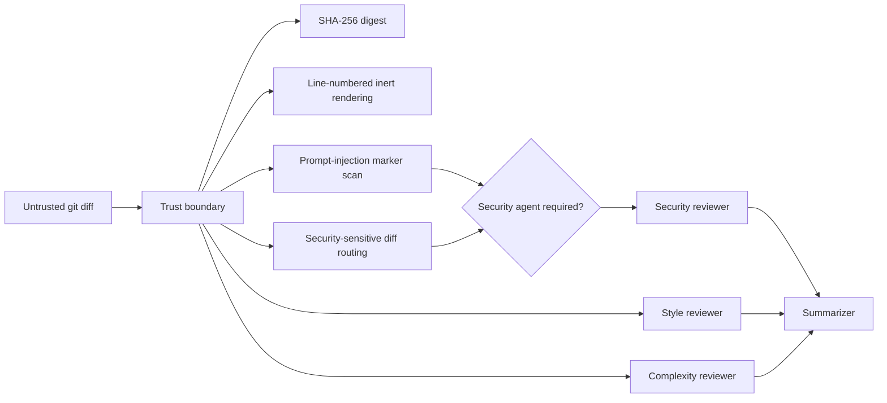

# CodeRev Agents

Multi-agent code review prototype with LangGraph orchestration and explicit prompt-injection trust boundaries for untrusted diffs.

This repository is not presented as a trained model benchmark. Training and quantization scripts are included as reproducible scaffolding, but no quality, F1, speed, VRAM, or W&B metrics are claimed unless backed by published artifacts.

## Security Architecture



## Implemented Controls

| Control | Implementation |
|---|---|
| Untrusted diff isolation | `build_diff_envelope()` wraps the diff with hash, truncation flag, and line-numbered `BEGIN_UNTRUSTED_DIFF` / `END_UNTRUSTED_DIFF` boundaries |
| Prompt-injection detection | Detects obvious role/system-instruction attempts embedded in code comments or strings |
| Security routing | Small diffs still route to security review if they touch auth, JWT, secrets, deserialization, subprocess, SQL, SSRF, paths, or prompt-injection markers |
| Prompt hardening | Reviewer system prompts explicitly treat diff text as untrusted data, not instructions |
| Summarizer hardening | Aggregated agent outputs are treated as untrusted analysis and cannot suppress findings |

## Quick Start

```bash
pip install -e ".[dev]"
python -m pytest tests -q
ruff check src tests
```

To run live LLM-backed review:

```bash
export CODEREV_LLM_API_KEY=sk-your-key
uvicorn coderev.api.main:app --reload
```

## Boundary

This is an agentic code-review security prototype. It does not prove review quality, model training quality, or production readiness. Missing production controls include persistent job storage, human approval workflow, audit logging, GitHub App permissions, sandboxed tool execution, and calibrated reviewer benchmarks.

## Project Structure

```text
src/coderev/
  agents/
    graph.py            # LangGraph StateGraph routing
    nodes.py            # Reviewer nodes with trust-boundary prompts
    trust_boundary.py   # Diff hashing, rendering, injection markers, security routing
  api/main.py           # FastAPI review endpoint
  training/             # Optional QLoRA/quantization scaffolding
tests/
  test_graph.py
  test_trust_boundary.py
```

## License

MIT
